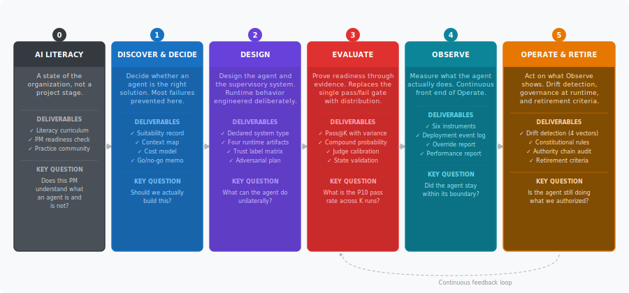

# Agentic AI for Product Managers
## A Lifecycle Framework for Building, Evaluating, and Governing Agentic Systems

*Version 3.0 | Agentic PM Lifecycle Series*

---

This wiki covers every phase of bringing an agentic AI product to life: from deciding whether to build at all, through design, evaluation, observation, and governance. It is written for product managers who know their current tools well and are making the transition to a fundamentally different kind of system.

Each section is self-contained. Read them in order the first time. Use them as reference afterward.

---

## Sections

| Section | What it covers |
|---|---|
| [Preface](00-preface.md) | Why the old PM frameworks are not enough, the new questions agentic AI requires, how this framework is organized |
| [Phase 0 — AI Literacy](01-ai-literacy.md) | Five mental model shifts every PM needs before any agentic project begins |
| [Phase 1 — Discover and Decide](02-discover-and-decide.md) | The four suitability conditions, the cost model, the go/no-go memo |
| [Phase 2 — Design](03-design.md) | The four runtime artifacts, consequence classification, adversarial design |
| [Phase 3 — Evaluate](04-evaluate.md) | Pass@K, compound probability, LLM-as-judge, True Negative Rate |
| [Phase 4 — Observe](05-observe.md) | Six observation instruments, automation complacency, silent degradation |
| [Phase 5 — Operate, Govern, and Retire](06-operate-govern-retire.md) | Four drift vectors, constitutional rules, authority delegation chain, retirement |
| [PM Tools and Templates](07-tools-and-templates.md) | Go/no-go memo, runtime artifact checklist, eval deliverables, drift policy |

---

## The lifecycle at a glance

---

## Key frameworks at a glance

**The Three Contracts** — the most important design decision in any agentic product. Must be named before any other design work begins.
- Contract 1: Suggestion Engine (human decides and acts)
- Contract 2: Copilot (agent acts on explicit confirmation)
- Contract 3: Autonomous Actor (agent acts; human supervises the system)

**The Four Runtime Artifacts** — required for every agentic product, regardless of contract.
- Autonomy boundary
- Approval moment
- Audit surface
- Recovery workflow

**The Four Suitability Conditions** — all four must pass before autonomous operation.
- Repeats at volume
- Outcome measurable and trusted
- Tool use bounded
- Consequences recoverable

**The Six Observation Instruments** — design these before launch, not after.
- Task success rate
- Unintended action rate
- Override frequency
- Confidence calibration
- Rollback time
- Incident recovery time

**The Four Drift Vectors** — check all four at every post-release review.
- Model drift
- Data drift
- Supervision drift
- Scope drift

---

## Framework glossary

A full glossary of all terms used in this framework is at the end of the [PM Tools and Templates](07-tools-and-templates.md) section.

---

*[Agentic AI for Busy Product Managers](https://data-decisions-and-clinics.ghost.io/agentic-ai-for-busy-product-managers/)*
